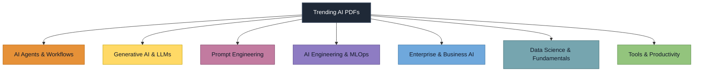
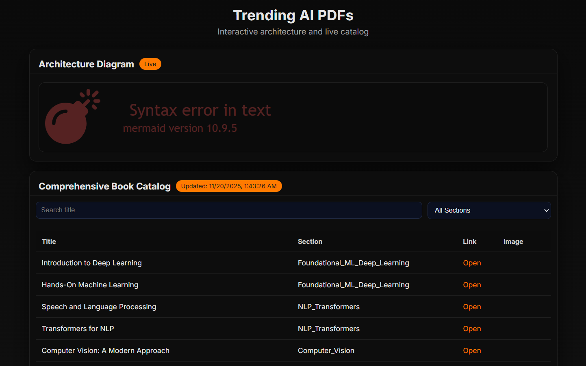

<!-- 
┌────────────────────────────────────────────────────────────────────────┐
│  ████████╗██████╗░██╗░██████╗░███████╗  ██████╗░░█████╗░██████╗░███████╗  │
│  ╚══██╔══╝██╔══██╗██║██╔════╝░██╔════╝  ██╔══██╗██╔══██╗██╔══██╗██╔════╝  │
│  ░░░██║░░░██████╔╝██║██║░░██╗░█████╗░░  ██████╔╝███████║██████╔╝█████╗░░  │
│  ░░░██║░░░██╔══██╗██║██║░░╚██╗██╔══╝░░  ██╔═══╝░██╔══██║██╔═══╝░██╔══╝░░  │
│  ░░░██║░░░██║░░██║██║╚██████╔╝███████╗  ██║░░░░░██║░░██║██║░░░░░███████╗  │
│  ░░░╚═╝░░░╚═╝░░╚═╝╚═╝░╚═════╝░╚══════╝  ╚═╝░░░░░╚═╝░░╚═╝╚═╝░░░░░╚══════╝  │
│                        PDF REPOSITORY FOR AI ENTHUSIASTS                   │
└────────────────────────────────────────────────────────────────────────┘
-->

<div align="center">

[](#)
[](#)
[](#)
[](#)
[](#)


<h1>📚 Trending AI PDFs (AICB-2025-MNJ)</h1>

<p align="center">
  <em>Your Gateway to Cutting-Edge AI Literature</em>
</p>

<p align="center">
  
</p>

</div>

---

## 📖 Introduction

Welcome to the **Trending AI PDFs** repository – a meticulously curated collection of AI-related PDF cookbooks and books. This repository serves as a structured catalog of invaluable resources for researchers, practitioners, and enthusiasts in the field of Artificial Intelligence.

Our mission is to democratize access to cutting-edge AI knowledge by organizing essential literature across various domains, from foundational machine learning concepts to specialized areas like MLOps and AI ethics.

<details>
<summary>💡 Why This Repository?</summary>

This project was created to address the challenge of navigating the vast landscape of AI literature. With thousands of publications emerging each year, finding quality resources can be overwhelming. We've handpicked the most influential and accessible materials to accelerate your learning journey.

</details>

---

## 🛠️ Tools & Technologies
 
| Tool | Purpose |
| :--- | :--- |
| **🔄 n8n** | Automate fetching PDF data and populating Google Sheets |
| **📊 Google Sheet** | Metadata database and primary application source |
| **🧩 AntiGravity** | AI Agent for building the application interface, data fetching, and search |
| **🐙 GitHub** | Code hosting and version control linked to deployment |
| **🚀 Vercel** | Instant deployment and automatic updates on push |

**⭐ Result:** A smart, self-updating PDF platform.

---

## �️ Features

✨ **Comprehensive Coverage**: Books spanning all major AI disciplines  
🔗 **Direct Access**: Instant downloads of full PDFs  
🖼️ **Visual Previews**: First-page thumbnails for quick browsing  
📚 **Structured Organization**: Categorized by AI specialty areas  
🔄 **Regularly Updated**: Fresh content added monthly  
🔍 **Easy Navigation**: Clean table format for effortless browsing  

<p align="center">
  
</p>

---

## ⚙️ Installation

No installation required! This is a static repository of PDF documents. Simply browse the catalog below and download the resources that interest you.

However, if you wish to contribute or modify the repository structure:

```bash
# Clone the repository
git clone https://github.com/your-repo/trending-ai-pdfs.git

# Navigate to the project directory
cd trending-ai-pdfs

# Explore the content
ls -la
```

---

## 🚀 Usage

1. Browse our categorized book catalog below
2. Click on any "[Download PDF]" link to access the full document
3. Preview the content using the first-page image thumbnails
4. Save your favorite resources for offline reading

<details>
<summary>🚀 Quick Start Guide</summary>

1. **AI Agents & Workflows**: Autonomous agents and multi-agent systems
2. **Generative AI & LLMs**: Transformers, RAG, and large language models
3. **Prompt Engineering**: Optimization and jailbreaking techniques
4. **Data Science & Fundamentals**: Core math, stats, and Python/ML basics
5. **AI Engineering & MLOps**: Deployment, monitoring, and production AI
6. **Enterprise & Business AI**: AI adoption, strategy, and market impact
7. **Tools & Productivity**: IDEs and productivity tools for AI

</details>

---

## �📂 Project Structure

The repository is organized into the following modern AI categories:

- **AI Agents and Agentic Workflows** — Autonomous agents, multi-agent systems, and workflows.
- **Generative AI and LLMs** — Large Language Models, RAG, transformers, and generative techniques.
- **Prompt Engineering** — Techniques for optimizing model outputs and jailbreaking.
- **AI Engineering and MLOps** — Production, deployment, system architecture, and DevOps for AI.
- **Enterprise and Business AI** — Strategic adoption, market reports, finance, and business impact.
- **Data Science and Fundamentals** — Core math, statistics, python, and foundational ML.
- **Tools and Productivity** — VS Code, Cursor, and productivity tools for AI dev.

---

## 🧩 Architecture Diagram



- For an interactive, animated version, open `docs/index.html` in this repository.

---

## 🧪 Testing

As this is a repository of static documents, traditional software testing doesn't apply. However, we ensure quality through:

- ✅ Manual verification of all download links
- ✅ Validation of PDF file integrity
- ✅ Confirmation of thumbnail image quality
- ✅ Regular review of content relevance

---

## 📈 Roadmap

- [x] Initial repository creation
- [x] Core book catalog establishment
- [ ] Interactive web interface development
- [ ] Search and filtering capabilities
- [ ] Community contribution guidelines
- [ ] Mobile-responsive design
- [ ] Integration with citation tools

---

## 🤝 Contributing

We welcome contributions from the AI community! Here's how you can help:

1. **Add New Resources**: Suggest quality AI books or papers
2. **Improve Organization**: Help categorize content more effectively
3. **Fix Broken Links**: Report any inaccessible documents
4. **Enhance Metadata**: Provide better descriptions or tags

To contribute:
1. Fork the repository
2. Create a feature branch
3. Commit your changes
4. Push to the branch
5. Open a pull request

<details>
<summary>📋 Contribution Guidelines</summary>

- Ensure suggested resources are freely available or properly licensed
- Provide accurate metadata (titles, authors, descriptions)
- Follow existing naming conventions
- Verify all links before submitting
- Focus on recent and relevant publications

</details>

---

## 📜 License

This repository is licensed under the MIT License - see the [LICENSE](LICENSE) file for details.

Individual books and documents retain their original licenses. We recommend checking each publication's specific licensing terms before redistribution or commercial use.

---

## 🌐 Community & Links

- [🌐 Official Website](https://github.com/)
- [💬 Discord Community](https://discord.gg/)
- [🐦 Twitter](https://twitter.com/)
- [💼 LinkedIn](https://linkedin.com/)
- [📧 Contact Us](mailto:contact@example.com)

<details>
<summary>🔗 Useful Resources</summary>

- [ArXiv](https://arxiv.org/) - Open-access archive for scholarly articles
- [Papers With Code](https://paperswithcode.com/) - Latest ML papers with code
- [AI Conference Deadlines](https://aideadlin.es/) - Track important conference dates
- [Distill](https://distill.pub/) - Clear explanations of ML concepts

</details>

---

## 📚 Comprehensive Book Catalog

<p align="center">
  <a href="./docs/index.html">
    
  </a>
  <br />
  <em>Open the live catalog page</em>
  
</p>

---

## ❓ FAQ

<details>
<summary>📌 How often is the repository updated?</summary>
We aim to add new resources monthly and review existing content quarterly for relevance.
</details>

<details>
<summary>📌 Can I contribute my own AI publications?</summary>
Yes! We welcome community contributions. Please see our contribution guidelines above.
</details>

<details>
<summary>📌 Are these books free to download and use?</summary>
All resources in this repository are freely available, but individual licensing terms may apply.
</details>

<details>
<summary>📌 How can I suggest improvements to the repository?</summary>
Please open an issue on GitHub or submit a pull request with your suggestions.
</details>

---

## 🎉 Quick Demo

<p align="center">
  
</p>

---

## 🚀 Ready to Explore?

Start your AI learning journey today by browsing our comprehensive catalog above. Happy reading!

---

<p align="center">
  <strong>🌟 Empowering the AI Community One Document at a Time 🌟</strong>
</p>

<pre align="center">
┌─────────────────────────────────────────────────────────────────┐
│  ░█████╗░██████╗░███████╗░█████╗░███╗░░██╗  ██████╗░███████╗  │
│  ██╔══██╗██╔══██╗██╔════╝██╔══██╗████╗░██║  ██╔══██╗██╔════╝  │
│  ███████║██║░░██║█████╗░░███████║██╔██╗██║  ██████╔╝█████╗░░  │
│  ██╔══██║██║░░██║██╔══╝░░██╔══██║██║╚████║  ██╔═══╝░██╔══╝░░  │
│  ██║░░██║██████╔╝███████╗██║░░██║██║░╚███║  ██║░░░░░███████╗  │
│  ╚═╝░░╚═╝╚═════╝░╚══════╝╚═╝░░╚═╝╚═╝░░╚══╝  ╚═╝░░░░░╚══════╝  │
│                                                                 │
│        ██████╗░██████╗░░█████╗░██████╗░████████╗               │
│        ██╔══██╗██╔══██╗██╔══██╗██╔══██╗╚══██╔══╝               │
│        ██████╔╝██████╔╝██║░░██║██████╔╝░░░██║░░░               │
│        ██╔═══╝░██╔══██╗██║░░██║██╔══██╗░░░██║░░░               │
│        ██║░░░░░██║░░██║╚█████╔╝██║░░██║░░░██║░░░               │
│        ╚═╝░░░░░╚═╝░░╚═╝░╚════╝░╚═╝░░╚═╝░░░╚═╝░░░               │
│                                                                 │
│                 PDF KNOWLEDGE BASE FOR AI EXPERTS              │
└─────────────────────────────────────────────────────────────────┘
</pre>
